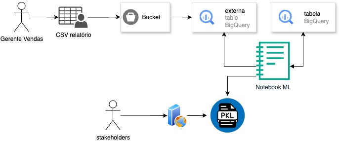

# Visão Geral do Processo de Análise de dados de vendas
Este diagrama descreve o fluxo de dados e processos para analisar dados de vendas e gerar um modelo de Machine Learning para auxiliar na tomada de decisões.

*Geração do Relatório:* O processo começa com o Gerente de Vendas, que gera um relatório de vendas em formato CSV (Comma-Separated Values).
*Armazenamento dos Dados:* O relatório CSV é então armazenado em um Bucket (um serviço de armazenamento em nuvem, como o Google Cloud Storage ou Amazon S3).

*Ingestão no BigQuery:* Os dados do CSV no Bucket são disponibilizados no BigQuery através de uma tabela externa ("externa table"). Adicionalmente, pode haver uma tabela padrão no BigQuery ("tabela"), que armazena dados relacionados.

*Análise e Modelagem:* Um Notebook de Machine Learning (por exemplo, um Jupyter Notebook) é utilizado para analisar os dados presentes nas tabelas do BigQuery. Este notebook realiza tarefas de limpeza, exploração e modelagem dos dados.

*Geração do Modelo:* Após a análise, o Notebook ML treina um modelo de Machine Learning e o salva em um arquivo no formato PKL (usando a biblioteca pickle do Python). Este arquivo contém o modelo treinado, pronto para ser utilizado.

*Disponibilização para Stakeholders:* O modelo treinado (arquivo PKL) é então disponibilizado para os stakeholders (partes interessadas). Os stakeholders podem utilizar o modelo para fazer previsões, análises ou tomar decisões baseadas nos dados de vendas.

Em resumo, este processo automatiza a análise de dados de vendas, desde a geração do relatório até a disponibilização de um modelo de Machine Learning para auxiliar os stakeholders.
## Diagrama do processo de analise de dados

---
# Arquitetura do Projeto

A arquitetura geral do projeto é composta pelos seguintes componentes:

* Google Cloud Storage (GCS) — Armazena os dados brutos (arquivos CSV) e os artefatos do modelo.

* BigQuery — Camada analítica para armazenamento e consulta dos dados transformados.

* Vertex AI / Notebook Jupyter — Ambiente de treinamento e experimentação do modelo de Machine Learning.

* API (FastAPI) — Interface REST para servir o modelo e realizar previsões.

* Terraform — Responsável pela criação automatizada dos recursos GCP (Storage, BigQuery, etc.).
---

# Infraestrutura
## Descrição da Infraestrutura

Este projeto utiliza Terraform para provisionar uma infraestrutura de dados na Google Cloud Platform (GCP) com os seguintes componentes:

* *Bucket no Cloud Storage:* Criado com nome único, ele armazena um arquivo CSV contendo dados de vendas.

* *Upload de arquivo CSV:* O arquivo de dados é enviado automaticamente para o bucket, na estrutura raw/vendas/.

* *Dataset no BigQuery:* Um dataset chamado Dataset Vendas BMW é criado para organizar as tabelas.

* *Tabela externa no BigQuery:* É criada uma tabela externa que lê os dados diretamente do CSV no bucket, sem importar os dados para o BigQuery. O schema da tabela é detectado automaticamente.

Essa estrutura permite processar e consultar dados diretamente a partir de arquivos armazenados no Cloud Storage, facilitando a ingestão e análise de dados em larga escala com baixo custo.

---
# Tecnologias Utilizadas
|Categoria|Tecnologias|
|---------|-----------|
|Linguagem Principal | Python 3
|Infraestrutura | Terraform (Provider: Google)
|Cloud | Google Cloud Platform (GCS, BigQuery, Vertex AI)
|API | FastAPI
|Machine Learning | Scikit-learn, Pandas, NumPy
|Controle de Versão | Git / GitHub

